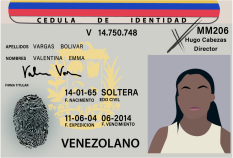

<section class="interactive">
  

    <!-- content for passport-->
    

      

        
Pasaporte

        

          Haga clic en las flechas o los puntos para navegar
        

      

      <!-- slideshow goes here -->
      

        

          <!-- first slide -->
          

            

              
              

                
Los pasaportes venezolanos vienen en colores azul marino y burdeos. Para obtener un pasaporte, los ciudadanos deben registrarse para una cita en internet entre las 5:30 p. m. y las 5 a. m. Usualmente hay muchos meses de espera para una segunda cita después de la primera cita.

                
Las citas son hechas a través de la agencia de registro civil conocida como SAIME (Servicio
                  Administrativo de Identificación, Migración y Extranjería). 

              

            

          

          <!-- second slide -->
          

            

              
              

                
Obtenido a través de medios oficiales, un pasaporte venezolano cuesta alrededor de USD $1.55. Aunque esto puede parecer poco, el salario mínimo actual está alrededor de USD $6.

                
Algunos eligen otro medios de evitar el largo proceso frustrante y obtiene el pasaporte a través del mercado negro con costos por más de USD $62.

                
Sin embargo, hasta el primero de noviembre de 2018, los pasaportes debían ser pagados en las
                  criptomonedas Petro. Se supone que la moneda está respaldada por petróleo y reservas minerales. Los
                  pasaportes costarán 2 Petros (alrededor de 7.200 bolívares) lo cual equivale a 4 meses de salario.
                

              

            

          

          

            

              
              

                

                  Un pasaporte venezolano no es sólo un documento para viajar, sino que también es una prueba de identidad y significa tener voz en el gobierno. Con más de 3 millones de venezolanos en el extranjero, el 60% de ellos tienen estado indocumentado, lo cual significa que no pueden votar en las elecciones debido a la ausencia de documentación.
                

                

                  Aquellos que no tienen otra opción más que dejar Venezuela sin pasaporte, están en riesgo y deben luchar para obtener una prueba de residencia en su país de destino. Esto limita el acceso a la educación, al sistema de salud y la posibilidad de ejercer trabajos.
                

              

            

          

          

            

              
              

                
Los pasaportes se están volviendo casi imposibles de obtener debido a la ausencia de recursos para hacer los documentos, los precios inasequibles y las ineficiencias administrativas.

                
Informados de ésto, el Gobierno colombiano ha decidido ayudar a los venezolanos dentro de las fronteras del país, ya que no pudieron renovar sus pasaportes en Venezuela.

                

                  Empezando a inicios de marzo del 2019, el Gobierno colombiano extendió la validez de los pasaportes venezolanos desde 2 años pasada la fecha de expiración. Más de 500.000 venezolanos pueden beneficiar de esta decisión.
                

                
* Datos de Migración Colombia

              

            

          

          <!-- slideshow buttons -->
          

            <a class="prev" onclick="plusSlidesPassport(-1)">&#10094;</a>
            <a class="next" onclick="plusSlidesPassport(1)">&#10095;</a>
          

        

        

          
Retroceder

        

        

          
          
          
          
        

      

      <!-- bottom caption -->
    

    <!-- end of content for passport -->
    <!-- content for pep-->
    

      

        
PEP

        

        Haga clic en las flechas o los puntos para navegar
      

      

      <!-- slideshow goes here -->
      

        

          <!-- first slide -->
          

            

              
              

                

                  PEP es la abreviación de <em>Permiso Especial de Permanencia</em> y es un permiso especial otorgado a
                  los venezolanos que buscan refugio en Colombia.
                

              

            

          

          <!-- second slide -->
          

            

              
              

                

                  Los Venezolanos pueden aplicar para el PEP si llegaron a Colombia a través de un documento de
                  inmigración autorizado antes del 17 de diciembre de 2018, y si no tienen un antecedentes criminales.
                    
                  Para obtener el PEP, se necesita un pasaporte o una tarjeta de identificación.
                

              

            

          

          

            

              
              

                

                  The El PEP es válido por 90 días y es extensible por un máximo de 2 años. Una vez obtenido, los
                  venezolanos pueden trabajar, estudiar, acceder al sistema de salud y realizar actividades legales en
                  Colombia.
                

              

            

          

          

            

              
              

                

                  Hasta diciembre de 2018, <strong>1’174.743</strong> venezolanos habían inmigrado en Colombia. Sólo el
                  <strong>45,6%</strong> de ellos obtuvieron el PEP.  En total, más de la mitad de los venezolanos en Colombia están indocumentados.

                
* Datos de Migración Colombia

              

            

          

          <!-- slideshow buttons -->
          

            <a class="prev" onclick="plusSlides(-1)">&#10094;</a>
            <a class="next" onclick="plusSlides(1)">&#10095;</a>
          

        

        

          
Retroceder

        

        

          
          
          
          
        

      

      <!-- bottom caption -->
    

    <!-- end of content for pep -->
    <!-- contont for National id -->
    

      

        
Identificación venezolana

        

        Haga clic en las flechas o los puntos para navegar
      

      

      <!-- slideshow goes here -->
      

        

          <!-- first slide -->
          

            

              
              

                

                  Una tarjeta de identificación venezolana, también conocida como <em>Cédula de identidad</em>, es la
                  identificación nacional que el Gobierno venezolano tramita. Muchos países, como China (tarjeta de
                  identidad de residente PRC) y Francia (Tarjeta nacional de identidad) utilizan documentos nacionales
                  de identidad.
                

              

            

          

          <!-- second slide -->
          

            

              
              

                

                  Para obtener una cédula, los venezolanos deben tener al menos 9 años y proveer un certificado de
                  nacimiento original.
                

                

                  Es difícil estar un día sin necesitar una cédula. Estas son utilizadas para hacer compras, votar,
                  viajar nacional e internacionalmente y para permanecer en hoteles.
                  Las cédulas tienen un número utilizado para identificar a cada ciudadano.

              

            

          

          

            

              
              

                

                  Se está volviendo casi imposible obtener una cédula debido al recorte de los recursos para hacer los
                  documentos. La mayoría de oficinas no tienen las impresoras necesarias y algunas que no pueden
                  imprimir le piden a los ciudadanos llevar su propio laminador.
                

                

                  Las cédulas fueron alguna vez el principal documento que los migrantes venezolanos utilizaban para
                  entrar legalmente a los países que lo rodean, pero ahora, muchos países como Perú, están requiriendo
                  un pasaporte porque las cédulas son documentos fácilmente falsificables.
                

              

            

          

          

            

              
              

                

                  Desde diciembre de 2016, el presidente Nicolás Maduro desplegó una nueva tarjeta de identificación
                  llamada <em>El Carnet de la Patria</em>. Más de la mitad de la población se ha inscrito por la nueva
                  tarjeta.
                

                

                  El nuevo documento de identificación ha venido bajo críticas por ser un medio para el gobierno
                  supervisar a los ciudadanos y asignarles recursos escasos. La tarjeta da un montón de información
                  personal a los servicios de cómputo, como la ubicación de la persona o por quién votó.
                

                

                  En un viaje en el 2008, los oficiales venezolanos descubrieron que la compañía china ZTE estaba
                  desarrollando un sistema que ayudaría a Beijing a rastrear el comportamiento de los ciudadanos. Cerca
                  de 6 años después, ZTE fue contratado para construir la base de datos de las Tarjetas de la Patria.
                

                
* Datos de El Tiempo y Migración Colombia

              

            

          

          <!-- slideshow buttons -->
          

            <a class="prev" onclick="plusSlidesID(-1)">&#10094;</a>
            <a class="next" onclick="plusSlidesID(1)">&#10095;</a>
          

        

        

          
Retroceder

        

        

          
          
          
          
        

      

      <!-- bottom caption -->
    

    <!-- end of content for national ID -->
    <!-- front page -->
    

      

        

          <h2 class="interactive__title">Indocumentado</h2>
          <h3 class="interactive__subhead">El limbo legal de los venezolanos en colombia</h3>
          
        

        

          
Haga clic para explorar la documentación

        

        

          

            

              
            

            

              
Pasaporte

            

          

          

            

              
            

            

              
PEP

            

          

          

            

              
            

            

              
Identificación venezolana

            

          

        

      

    

</section>

