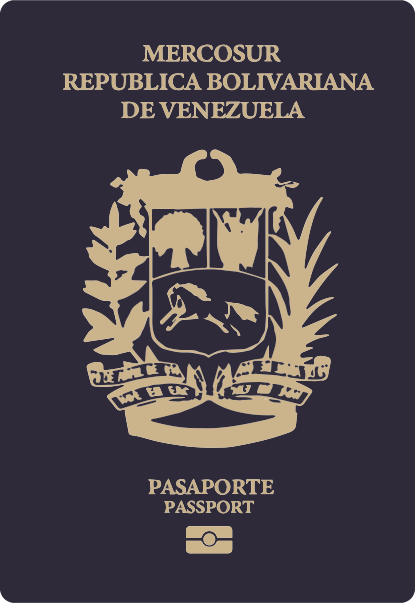
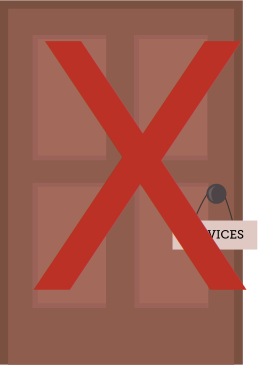
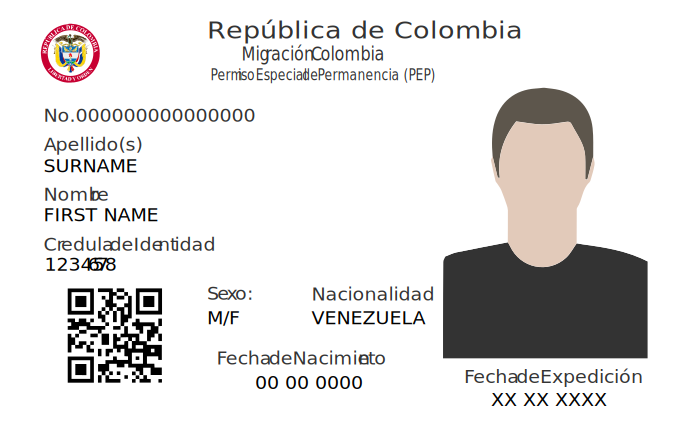
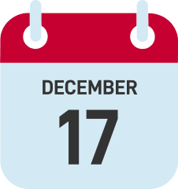
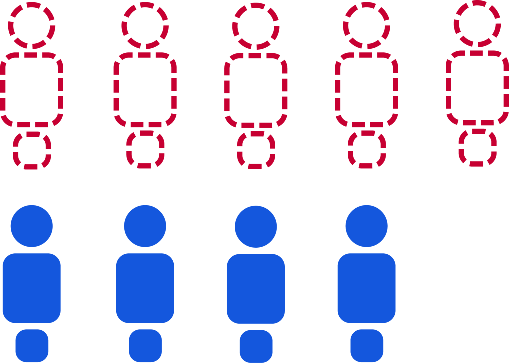
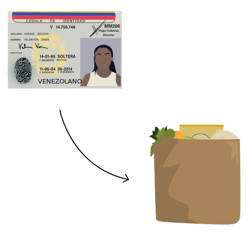
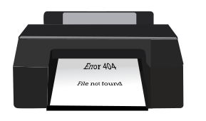

<section class="interactive">
  

    <!-- content for passport-->
    

      

        
Passport

        

          Click the arrows or the dots to navigate
        

      

      <!-- slideshow goes here -->
      

        

          <!-- first slide -->
          

            

              
              

                
The Venezuelan passport comes in navy blue or burgundy. To obtain a passport, citizens must register
                  for an appointment online between 5:30 p.m. to 5 a.m. Usually, there is a month-long wait for a
                  follow-up
                  after the first appointment. 

                
Appointments are made through the civil registry agency known as SAIME (Servicio Administrativo de
                  Identificación, Migración y Extranjería). 

              

            

          

          <!-- second slide -->
          

            

              
              

                
When obtained through official means, a Venezuelan passport costs about USD $1.55. While this may not
                  seem expensive, the current minimum wage hovers around USD $6. 

                
Some choose to expedite the frustratingly long process and get a passport through the black market,
                  which costs upwards of USD $62.

                
However, as of November 1st, 2018, passports must be paid for in the Petro cryptocurrency. The
                  currency
                  is supposed to be backed by oil and mineral reserves. Passports will cost 2 Petros (about 7,200
                  bolivars) which is equivalent to 4 months salary. 

              

            

          

          

            

              
              

                

                  A Venezuelan passport is not just a travel document, but a proof of identity and a means of having a
                  say in the government. With over 3 million Venezuelans abroad, 60% of them have irregular status,
                  meaning they can’t vote in elections due to lack of documentation.
                

                

                  For those who have no choice but to leave Venezuela without a passport, they are at risk and may
                  struggle to obtain a proof of residence in their destination country. This limits access to education,
                  healthcare, and the ability to join the workforce.
                

              

            

          

          

            

              
              

                
Passports are becoming nearly impossible to get due to the lack of resources to make the documents,
                  unaffordable prices and administrative inefficiencies. 

                
With knowledge of this, the Colombian government has decided to help out Venezuelans within the
                  country’s borders who could not renew their passports back home.

                
Starting in early March of 2019, the Colombian government extended the validity of Venezuelan
                  passports
                  to two years past the expiration date. More than 500,000 Venezuelans could benefit from this decision.
                

                
* Data from Migración Colombia

              

            

          

          <!-- slideshow buttons -->
          

            <a class="prev" onclick="plusSlidesPassport(-1)">&#10094;</a>
            <a class="next" onclick="plusSlidesPassport(1)">&#10095;</a>
          

        

        

          
Back

        

        

          
          
          
          
        

      

      <!-- bottom caption -->
    

    <!-- end of content for passport -->
    <!-- content for pep-->
    

      

        
PEP

        

          Click the arrows or the dots to navigate
        

      

      <!-- slideshow goes here -->
      

        

          <!-- first slide -->
          

            

              
              

                
PEP is short for <em>Permiso Especial de Permanencia</em>, which is Spanish for Special Permit of
                  Permanence. It is a special permit granted to Venezuelans who seek refuge in Colombia.

              

            

          

          <!-- second slide -->
          

            

              
              

                

                  Venezuelans are eligible to apply for the PEP if they arrived in Colombia through an authorized
                  immigration post before December 17, 2018, and do not have a criminal record.
                  In order to obtain the PEP, either a Passport or Identity Card is required.

              

            

          

          

            

              
              

                

                  The PEP is valid for 90 days and is extendable for up to a maximum of 2 years. Once obtained,
                  Venezuelans are able to work, study, access the health system, and perform legal activity in Colombia.
                

              

            

          

          

            

              
              

                
As of December 2018, <strong>1,174,743</strong> Venezuelans have migrated to Colombia. Only
                  <strong>45.6%</strong> of them have obtained the PEP.  
                In total, more than half of the Venezuelans in Colombia are undocumented.

                
* Data from Migracion Colombia

              

            

          

          <!-- slideshow buttons -->
          

            <a class="prev" onclick="plusSlides(-1)">&#10094;</a>
            <a class="next" onclick="plusSlides(1)">&#10095;</a>
          

        

        

          
Back

        

        

          
          
          
          
        

      

      <!-- bottom caption -->
    

    <!-- end of content for pep -->
    <!-- contont for National id -->
    

      

        
Venezuelan ID

        

          Click the arrows or the dots to navigate
        

      

      <!-- slideshow goes here -->
      

        

          <!-- first slide -->
          

            

              
              

                
A Venezuelan ID Card, also known as a <em>Cédula de Identidad</em>, is the national identity card
                  Venezuela’s government issues. Many countries, such as China (PRC Resident Identity Card) and France (Carte
                  Nationale d’Identité), also have national identity cards. 

              

            

          

          <!-- second slide -->
          

            

              
              

                

                  To obtain a cédula, Venezuelans must be at least nine years old and provide an original birth
                  certificate.
                

                

                  It’s difficult to go a day without needing a cédula. They are used to make purchases, vote, travel
                  domestically and internationally, and stay in hotels.
                  
                Cédulas contain a number that is used to identify every citizen.

              

            

          

          

            

              
              

                
It’s becoming almost impossible to obtain a cédula due to the shortage of resources to make the
                  documents. Most offices do not have the printers needed to print the cédula, and some offices are
                  asking citizens to bring their own laminator.

                
Cédulas were once the main documentation Venezuelan migrants used to legally enter surrounding
                  countries, but now, many countries, such as Peru, are requiring a passport because cédulas are easy
                  documents to forge and falsify. 

              

            

          

          

            

              
              

                

                  Starting in December 2016, President Nicolás Maduro rolled out a new identity card called the
                  <em>Carnet de la Patria</em>, or “Fatherland Card.” Over half the population has enrolled for the new
                  card.
                

                

                  The new ID card has come under criticism as being a means for the government to monitor citizens and
                  allocate scarce resources. The card gives a lot of personal data to computer services, such as a
                  person's location or whether someone voted.
                

                

                  On a trip in 2008, Venezuelan officials learned that Chinese company ZTE was developing a system that
                  would help Beijing track its citizens' behaviors. About six years later, ZTE was hired to build the
                  fatherland card database.
                

                
* Data from El Tiempo and Migracion Colombia

              

            

          

          <!-- slideshow buttons -->
          

            <a class="prev" onclick="plusSlidesID(-1)">&#10094;</a>
            <a class="next" onclick="plusSlidesID(1)">&#10095;</a>
          

        

        

          
Back

        

        

          
          
          
          
        

      

      <!-- bottom caption -->
    

    <!-- end of content for national ID -->
    <!-- front page -->
    

      

        

          <h2 class="interactive__title">Undocumented</h2>
          <h3 class="interactive__subhead">The Legal Limbo of Venezuelans in Colombia</h3>
          
        

        

          
Click to explore the documentation

        

        

          

            

              
            

            

              
Passport

            

          

          

            

              
            

            

              
PEP

            

          

          

            

              
            

            

              
Venezuelan ID

            

          

        

      

    

</section>

