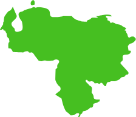

<section class="interactive">
  

    <h2 class="interactive__title">El estatus legal de la prostitución</h2>
    
    
La prostitución existe en un espectro legal. Utiliza el deslizador para aprender más sobre el estatus de la prostitución en Venezuela, Colombia y los Estados Unidos.

    

      

        
LEGAL

        
DEPENDE

        
ILEGAL

      

      <input type="range" min="1" max="100" value="10" class="slider" id="myRangeEs">
      

        

          

            
            
VENEZUELA

          

          

            
La prostitución es <strong>legal</strong> para mayores de 16 años.</h3>
              <h3>Sabías que...</h3>
              <ul>
                <li>Una caja de 36 condones se vendió en línea por aproximadamente $755. Esto refleja el costo creciente del sexo seguro en Venezuela, lo cual ha causado aumentos en las enfermedades de transmisión sexual y el embarazo precoz.</li>
                <li>Los traficantes sexuales han comenzado a apuntar a las mujeres venezolanas, por la mayor parte a las mujeres pobres e indígenas. Les prometen ropa, comida y alojamiento, lo cual las atrapa. Investigaciones sobre el asunto han revelado que el número de mujeres víctimas del tráfico sexual ha aumentado más del doble desde 2016.</li>
              </ul>
          

        

      

    

  

</section>