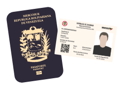

<section class="interactive" style="background-color: transparent;">
  

    

      

        

          
          <h2 class="interactive__title">BRAZOS ABIERTOS</h2>
          
El sistema educativo de Medellín recibe a inmigrantes venezolanos

        

        

          
Medellín, Colombia le ofrece la oportunidad de estudiar al <strong>100%</strong> de los niños inmigrantes.

          
          
*Los datos provienen de la Secretaría de Educación de Medellín

        

        

          

            El <strong>3%</strong> de los estudiantes de Medellín son venezolanos, y aún así hay espacio para <strong>22.000 más.</strong>  
            En cambio, el <strong>8%</strong> de los estudiantes en ciudades fronterizas son venezolanos. En esta región, <strong>faltan 8.000 puestos adicionales</strong> para suplir la necesidad.
          

          
          
*Los datos provienen de la Secretaría de Educación de Medellín y The New Humanitarian

        

        

          

            La migración afecta la asistencia escolar de los niños y jóvenes venezolanos, con tasas de inasistencia de <strong>40%</strong> entre inmigrantes.
          

          
          
*Los datos provienen del Banco Mundial

        

        

          

            A pesar de que el sistema educativo de Medellín esté abierto para los estudiantes venezolanos, muchos jóvenes luchan con factores adicionales a estas garantías institucionales.
            
Haz clic en los íconos siguientes
para obtener más información.

          

          

            
            
            
            
            

              
X

              
Se estima que hay 104.173 niños en Colombia sin documentos legales que les den acceso a servicios públicos, incluyendo pasaportes, la Tarjeta de Movilidad Fronteriza (TMF) o cédulas de extranjería. Cuando un niño venezolano ingresa al sistema educativo de Colombia, debe ser reportado a Migración Colombia con documentos oficiales. Por miedo a ser deportados, muchos niños no van al colegio.

              

              
*Los datos provienen de la Secretaría de Educación de Medellín

            

            

              
X

              
Los padres suficientemente afortunados de encontrar cupo escolar para sus hijos tienen problemas para pagar los uniformes y útiles escolares.  
                Todos los estudiantes deben usar uniformes en los colegios públicos y privados. La mayoría de ellos tienen dos versiones: uno de uso diario y uno para educación física. Cada uniforme cuesta aproximadamente 42.000 pesos ($16,80 USD).  
                Cada libro cuesta aproximadamente 32.000 pesos ($12,80 USD) y un morral cuesta 17.000 pesos ($6,80 USD).

              

                
              

              
*Los datos provienen de The New Humanitarian y Human Rights Watch

            

            

              
X

              
La alimentación balanceada no sólo contribuye a la permanencia escolar, sino también al rendimiento en las clases. A los niños que van al colegio con hambre les cuesta más concentrarse y a menudo se atrasan.

              

              
*Los datos provienen del Ministerio de Educación de Colombia

            

            

              
X

              
El transporte escolar cuesta 1.100 pesos colombianos, aproximadamente 35 centavos estadounidenses. La mayoría de los niños caminan al colegio para ahorrar, y la caminata puede tardar hasta 30 minutos. Cerca de la frontera, hay niños que caminan hasta 6 millas ida y vuelta cruzando el puente internacional Simón Bolívar de Venezuela a Colombia. Cada viaje tarda aproximadamente 2 horas.

              

              
*Los datos provienen del Banco Mundial y The New Humanitarian

            

          

          
        

      

    

  

</section>