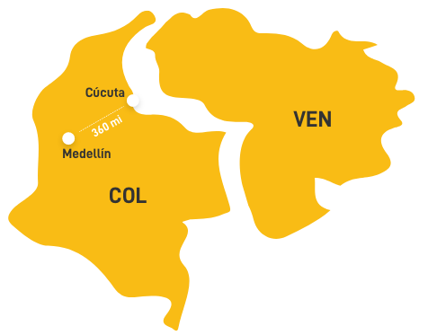
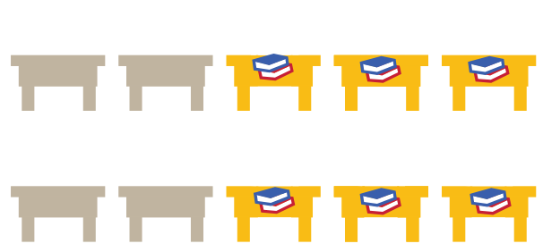
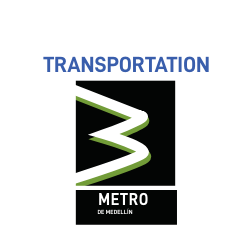

<section class="interactive" style="background-color: transparent;">
  

    

      

        

          
          <h2 class="interactive__title">OPEN ARMS</h2>
          
Medellín Education System welcomes Venezuelan refugees

        

        

          
<strong>100%</strong> of migrant children who seek education in Medellín, Colombia
            are given the opportunity. 

          
          
*Data from the Medellín Ministry of Education

        

        

          

            <strong>3%</strong> of all students in Medellín are Venezuelan and there are still <strong>22,000 open
              seats.</strong>  
            In comparison, <strong>8% </strong>of all students in schools along the Colombian border are Venezuelan. The
            education system <strong>needs 8,000 additional seats </strong>to fit the migrant demand.
          

          
          
*Data from the Medellín Ministry of Education and The New Humanitarian

        

        

          

            Migration affects attendance in the education system for Venezuelan children and teens, with absence rates
            around <strong>40%</strong> among all migrants.
          

          
          
*Data from The World Bank

        

        

          

            Despite the Medellín education system being so open to Venezuelan students, many children and teens face
            struggles outside of these institutional guarantees.
            
Hover and click on the icons below to learn more. 

          

          

            
            
            
            
            

              
X

              
It is estimated that 104,173 children do not have legal documents
                that
                grant them access to many government services. This includes passports, TMF (border mobility card) or
                foreigners identification cards. When a Venezuelan child enters school in Colombia, it must be legally
                reported to immigration with official documentation. Because of this, many children do not pursue
                education due to fear of deportation.

              

              
*Data from the Medellín Ministry of Education

            

            

              
X

              
Parents fortunate enough to find a classroom for their children have
                trouble affording uniforms and school supplies.  
                All students are required to wear uniforms in public and private schools. Uniforms consist of two sets:
                one for everyday use and another for physical education. Each school uniform costs around 42,000 pesos
                ($16.80 USD).  
                Each book is around 32,000 pesos ($12.80 USD), and a backpack is 17,000 pesos ($6.80 USD).

              

                
              

              
*Data from The New Humanitarian and The Human Rights Watch

            

            

              
X

              
Proper feeding contributes not only to the permanence of children in
                the educational system, but also to improving their school performance. Kids who go to school hungry may
                suffer an inability to concentrate and often fall behind academically.

              

              
*Data from The Colombia Ministry of Education

            

            

              
X

              
A bus cost for children to get to school is 1,100 COP, about 35 cents
                in the United States. Most children choose to walk to school to save money, and trips to school can take
                up to 30 minutes by foot. Along the border, children walk up to 6 miles each way across the Simón
                Bolívar bridge from Venezuela to Colombia, and each trip takes about 2 hours. 

              

              
*Data from The World Bank and The New Humanitarian

            

          

          
        

      

    

  

</section>